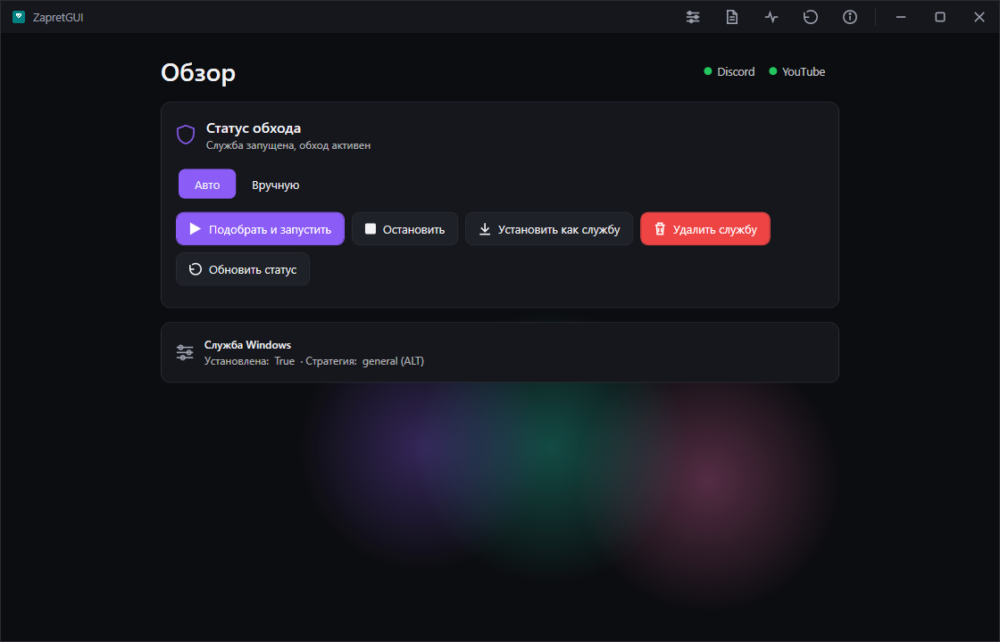
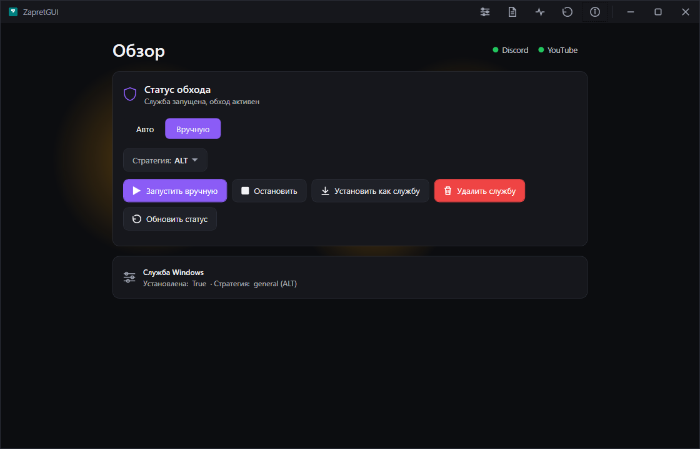

# 🗲 ZapretGUI

<p align="center">
  
  
  
  
</p>

<p align="center">
  <b>Графическая оболочка для обхода DPI-блокировок (ТСПУ) — без командной строки и страха что-то сломать</b>
</p>

## 📌 О проекте

**ZapretGUI** превращает консольный набор `.bat`-скриптов в понятное графическое приложение.

---
  <p align="center">
    
  </p>

ZapretGUI берёт эту сложность на себя:

- 🧠 **Автоподбор рабочей стратегии** — программа сама тестирует варианты и находит рабочий
- 🎛 **Ручной выбор стратегии** — для тех, кто хочет сам решать, как именно работает обход
- 🛠 **Режим "для опытных"** — полный список стратегий с возможностью запускать каждую отдельно и видеть точную команду, которая уходит в движок
- 🔄 **Проверка обновлений стратегий** — напрямую из репозитория Flowseal, без ручного скачивания архивов

---
  <p align="center">
    
    
  </p>


## ⚙️ Как это устроено

Важно понимать: ZapretGUI **не переписывает движок обхода** — это чистая графическая надстройка. Вся "магия" остаётся в проверенных инструментах, а программа лишь делает их доступными без консоли.

```
┌─────────────────────┐
│      ZapretGUI       │  ← графический интерфейс, автообновления, автоподбор
└──────────┬───────────┘
           │ запускает и парсит
┌──────────▼───────────┐
│ zapret-discord-youtube│  ← готовые стратегии и .bat-скрипты (Flowseal)
└──────────┬───────────┘
           │ основан на движке
┌──────────▼───────────┐
│        zapret         │  ← ядро обхода: nfqws / winws (bol-van)
└──────────┬───────────┘
           │ на Windows использует
┌──────────▼───────────┐
│      WinDivert         │  ← драйвер перехвата пакетов (basil00)
└───────────────────────┘
```

Технически на Windows нет встроенного механизма перехвата пакетов, как `netfilter` в Linux — поэтому используется сторонний драйвер **WinDivert**, который решает ту же задачу на уровне сетевого стека Windows. `winws.exe` — это порт логики `nfqws` под этот драйвер, а не что-то принципиально новое.

ZapretGUI никак не меняет и не переписывает эту логику — приложение напрямую парсит оригинальные `general*.bat` из репозитория Flowseal, поэтому обновление стратегий сводится к обновлению файлов, без пересборки программы.

## 🚀 Быстрый старт

1. Перейдите в [Releases](https://github.com/xe14plr/zapretGUI/releases/latest) и скачайте актуальный архив
2. Распакуйте в удобную папку *(избегайте кириллицы и пробелов в пути)*
3. Запустите `ZapretGUI.exe` от имени **администратора**

> [!WARNING]
> Драйвер **WinDivert** перехватывает сетевые пакеты для работы `winws.exe`, из-за чего антивирусы иногда выдают предупреждение (`Not-a-virus:RiskTool.Multi.WinDivert`). Это ожидаемое поведение легитимного инструмента — при необходимости добавьте папку программы в исключения.

## 🛠 Сборка из исходников

Потребуется **[.NET 8 SDK](https://dotnet.microsoft.com/download/dotnet/8.0)** и Windows 10/11 x64.

```bash
git clone https://github.com/xe14plr/zapretGUI.git
cd zapretGUI/src

# обычная сборка
dotnet build

# публикация автономного .exe
dotnet publish ZapretGUI.App -c Release -r win-x64 --self-contained true -p:PublishSingleFile=true -p:IncludeNativeLibrariesForSelfExtract=true -o ../publish
```

## 🗺 Roadmap

- [ ] Проверка и автообновление **самой программы** перед запуском (через GitHub Releases)
- [ ] Живая визуализация трафика и статуса обхода
- [ ] Раздел "для опытных" с ручным запуском отдельных стратегий и отображением полной команды

## 🙏 Благодарности

Этот проект существует благодаря труду других разработчиков — ZapretGUI лишь верхний, графический слой над их работой:

- **[bol-van/zapret](https://github.com/bol-van/zapret)** — ядро технологии обхода DPI (`nfqws`/`winws`)
- **[Flowseal/zapret-discord-youtube](https://github.com/Flowseal/zapret-discord-youtube)** — готовый набор стратегий и скриптов, на основе которого сделан этот форк
- **[basil00/Divert](https://github.com/basil00/Divert)** — драйвер WinDivert, обеспечивающий перехват пакетов на Windows

## ⚖️ Дисклеймер

Проект распространяется в образовательных и исследовательских целях. Используйте его в соответствии с законодательством вашей страны.

## 📄 Лицензия

Распространяется под лицензией [MIT](LICENSE).
