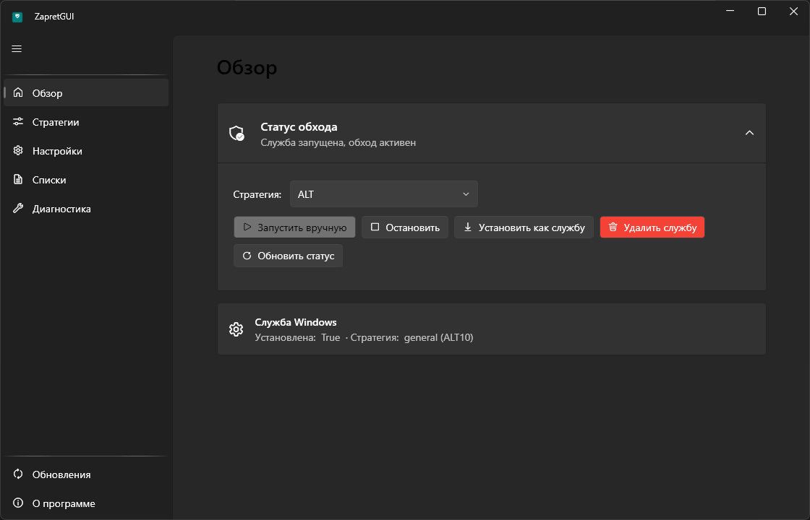

# ZapretGUI

Форк с графической оболочкой, основанный на репозитории [Flowseal/zapret-discord-youtube](https://github.com/Flowseal/zapret-discord-youtube).

Вся логика управления (запуск/остановка обхода, установка в автозапуск, настройки, диагностика) оригинального набора `.bat`-скриптов и `service.bat` перенесена в единое приложение с современным интерфейсом в стиле **Windows 11 (Fluent Design / Mica)**, вместо консольного меню.



## Что это

[zapret](https://github.com/bol-van/zapret) — инструмент для обхода DPI-блокировок (замедления YouTube, блокировок Discord и т.д.) на Windows, работающий поверх драйвера [WinDivert](https://github.com/basil00/Divert). [zapret-discord-youtube](https://github.com/Flowseal/zapret-discord-youtube) — набор готовых стратегий обхода и удобных `.bat`-скриптов поверх него.

**ZapretGUI** — это не переписывание zapret с нуля, а графическая оболочка над тем же самым `winws.exe`, теми же стратегиями и списками доменов/IP из оригинального репозитория. Все `general*.bat`-файлы используются как есть (парсятся напрямую), поэтому обновления стратегий из апстрима можно просто скопировать в папку `Strategies` — они появятся в приложении автоматически.

## Возможности

- **Обзор** — статус обхода (служба/процесс), быстрый выбор стратегии, запуск вручную или установка в автозапуск Windows, удаление службы
- **Стратегии** — список всех пресетов из оригинального репозитория с предпросмотром итоговой команды `winws.exe`
- **Настройки** — Game Filter (расширение диапазона портов для игр), IPSet Filter (none/loaded/any), автопроверка обновлений
- **Списки** — редактор пользовательских списков доменов и IP (`*-user.txt`) прямо в приложении
- **Диагностика** — проверка типичных причин, по которым обход не работает (Base Filtering Engine, системный прокси, TCP timestamps, конфликтующие антивирусы/VPN/Killer/Check Point/SmartByte, DNS-over-HTTPS, hosts-файл, зависшие службы WinDivert), очистка кэша Discord
- **Обновления** — проверка новой версии набора стратегий в репозитории Flowseal
- Тема интерфейса автоматически следует системной (светлая/тёмная), фон в стиле Mica

## Установка

1. Скачайте архив со страницы [Releases](../../releases/latest)
2. Распакуйте в папку без кириллицы и пробелов в пути
3. Запустите `ZapretGUI.exe` (потребуются права администратора — как и оригинальному zapret, ему нужны служба, реестр и драйвер WinDivert)

> [!WARNING]
> WinDivert может вызывать реакцию антивируса (детект вида `WinDivert` / `Not-a-virus:RiskTool.Multi.WinDivert`). Это легитимный инструмент перехвата трафика, используемый zapret — сам по себе он не вирус. При проблемах добавьте папку программы в исключения антивируса. Подробности — в [README оригинального проекта](https://github.com/bol-van/zapret-win-bundle/blob/master/readme.md#%D0%B0%D0%BD%D1%82%D0%B8%D0%B2%D0%B8%D1%80%D1%83%D1%81%D1%8B).

## Сборка из исходников

Требуется [.NET 8 SDK](https://dotnet.microsoft.com/download/dotnet/8.0) и Windows 10/11 x64.

```bash
git clone https://github.com/xe14plr/zapretGUI.git
cd zapretGUI/src
dotnet build
```

Публикация self-contained однофайлового релиза:

```bash
dotnet publish ZapretGUI.App -c Release -r win-x64 --self-contained true -p:PublishSingleFile=true -p:IncludeNativeLibrariesForSelfExtract=true -o ../publish
```

## Структура проекта

```
src/
  ZapretGUI.Core/     — бизнес-логика (парсер стратегий, служба Windows, диагностика, настройки), без UI-зависимостей
  ZapretGUI.App/       — WPF-приложение (WPF-UI, MVVM)
    Assets/bin/         — winws.exe, WinDivert, фейковые пакеты (из upstream zapret-win-bundle)
    Assets/lists/       — списки доменов и IP (из upstream)
    Assets/Strategies/  — general*.bat стратегии (из upstream, парсятся как есть)
```

## Благодарности

- [Flowseal/zapret-discord-youtube](https://github.com/Flowseal/zapret-discord-youtube) — стратегии, списки, идея удобных `.bat`-обёрток, на основе которых сделан этот GUI
- [bol-van/zapret](https://github.com/bol-van/zapret) и [bol-van/zapret-win-bundle](https://github.com/bol-van/zapret-win-bundle) — сам движок `winws.exe` и сборки WinDivert
- [lepoco/wpfui](https://github.com/lepoco/wpfui) — библиотека компонентов Fluent Design для WPF

Если вам помог обход — поддержите постановкой звезды оригинальным репозиториям и, по возможности, [оригинального автора zapret](https://github.com/bol-van/zapret?tab=readme-ov-file#%D0%BF%D0%BE%D0%B4%D0%B4%D0%B5%D1%80%D0%B6%D0%B0%D1%82%D1%8C-%D1%80%D0%B0%D0%B7%D1%80%D0%B0%D0%B1%D0%BE%D1%82%D1%87%D0%B8%D0%BA%D0%B0).

## Лицензия

[MIT](LICENSE)
